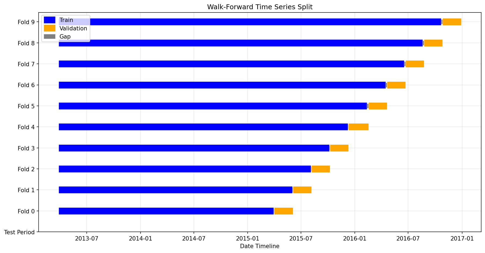
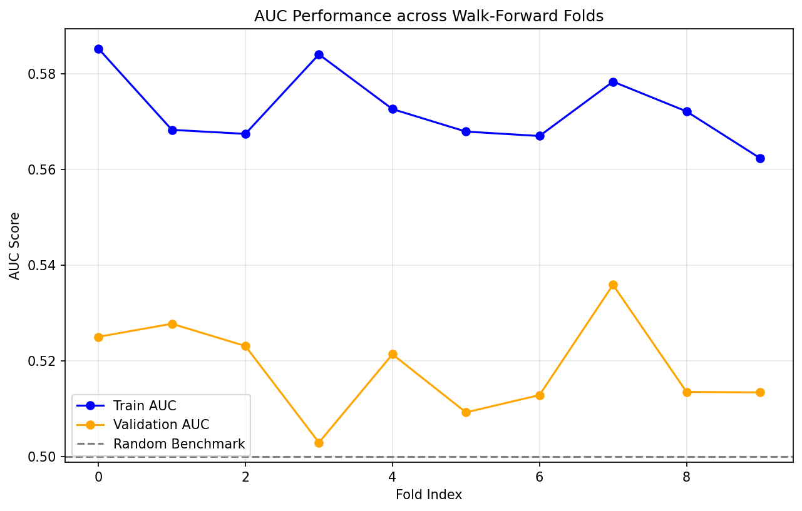
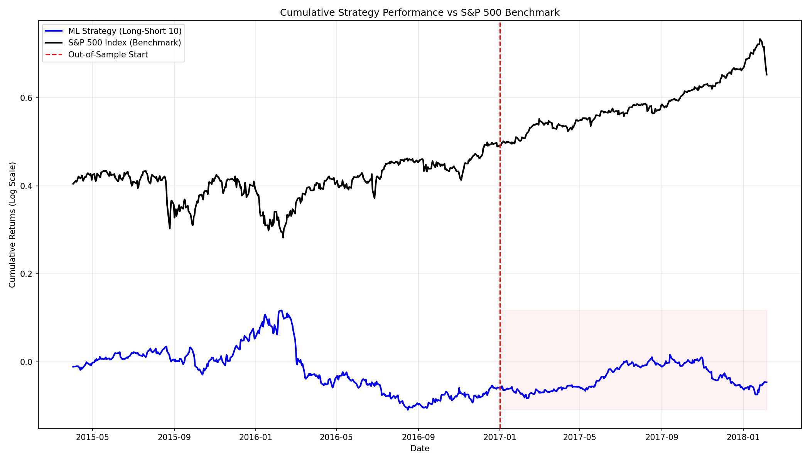

# S&P 500 Alpha Generation: ML-Driven Long-Short Framework

This repository implements a professional-grade, end-to-end quantitative trading pipeline designed to generate alpha signals for S&P 500 constituents using Machine Learning. The framework emphasizes **leakage-free** feature engineering, **date-aware** time-series cross-validation, and a **rank-based** stock-picking strategy.

## 🚀 Project Overview

The objective is to predict the sign of forward returns for individual S&P 500 stocks and translate those predictions into a market-neutral long-short strategy. The pipeline is designed to be robust, reproducible, and ready for systematic evaluation.

### Key Technical Pillars:
- **Leakage-Free Feature Engineering:** 11 stationary features computed per-ticker using trailing windows only, preventing look-ahead bias.
- **Walk-Forward Cross-Validation:** A 10-fold expanding window CV scheme simulates realistic deployment and ensures temporal integrity.
- **Cross-Sectional Normalization:** Features are Z-score normalized daily across all tickers to maintain comparability and focus on relative performance.
- **Risk-Adjusted Selection:** Model selection is based on a "Risk-Adjusted" AUC score, balancing high predictive power with low variance across CV folds.

---

## 📂 Repository Structure

```text
strat-ml-sp500-alpha/
├── data/
│   ├── processed/            # Cleaned, leakage-free train/test matrices
│   ├── all_stocks_5yr.csv    # Raw OHLCV data for S&P 500 constituents
│   └── HistoricalPrices.csv  # Raw  open-high-low-close (OHLC) SP500 index data
├── results/
│   ├── cross-validation/     # CV visualizations, metrics, and feature importances
│   ├── selected-model/       # Serialized pipeline (pkl) and selection reports
│   └── strategy/             # Backtest reports, PnL plots, and metrics
├── scripts/
│   ├── cv_utils.py           # Core CV splitters and visualization utilities
│   ├── features_engineering.py # Pipeline 1: Feature & target construction
│   ├── gridsearch.py         # Pipeline 2: Parallel hyperparameter optimization
│   ├── model_selection.py    # Pipeline 3: Final model fit & serialization
│   ├── create_signal.py      # Pipeline 4: Out-of-sample signal generation
│   └── strategy.py           # Pipeline 5: Strategy backtesting & performance analysis
├── requirements.txt          # Python dependencies
└── README.md                 # Project documentation
```

---

## 🛠 Installation & Usage

### 1. Environment Setup
It is recommended to use a dedicated environment (e.g., `sp500_env`).
```bash
conda create -n sp500_env python=3.11
conda activate sp500_env
```

```bash
# Clone the repository
git clone https://github.com/stkisengese/strat-ml-sp500-alpha.git
cd strat-ml-sp500-alpha

#Download datasets and save in data/ folder in the root
wget  https://assets.01-edu.org/ai-branch/project4/project04-20221031T173034Z-001.zip
unzip -j project04-20221031T173034Z-001.zip -d data/
rm project04-20221031T173034Z-001.zip

# Install dependencies
pip install -r requirements.txt
```

### 2. Execution Pipeline
Execute the scripts in sequence to reproduce the full analysis:

1.  **Feature Engineering:** `python scripts/features_engineering.py`
2.  **Grid Search:** `python scripts/gridsearch.py`
3.  **Model Selection:** `python scripts/model_selection.py`
4.  **Signal Generation:** `python scripts/create_signal.py`
5.  **Backtesting:** `python scripts/strategy.py`

---

## 📊 Methodology & Performance

### 1. Feature Engineering (11 Indicators)
We utilize a robust set of technical indicators capturing various market regimes:
- **Volatility:** Bollinger Band Width, ATR (Normalized).
- **Momentum:** RSI (Level & Change), MACD (Line, Signal, Hist), Williams %R.
- **Trend/Volume:** ADX (Trend Strength), OBV (Volume Momentum).

### 2. Validation Strategy: Walk-Forward Cross-Validation
To ensure temporal integrity and simulate real-world trading, we employ a 10-fold Walk-Forward expanding window scheme.



### 3. Model Training Metrics
The framework utilizes `HistGradientBoostingClassifier` within a pipeline that includes mean imputation and standard scaling. The model is optimized for AUC, prioritizing features that offer stable predictive signals across time-series folds.

The following plot shows the stability of training and validation metrics.



### 4. Backtesting Framework
- **Strategy:** Rank-based Long-Short (Top 10 / Bottom 10 stocks).
- **Execution:** $1 daily absolute investment, market-neutral.
- **Target:** Sign of return for the interval $[D+1 \rightarrow D+2]$, predicted using information available at $D$.
- **Performance:** Cumulative PnL of the strategy versus the S&P 500 benchmark.



---

## 📉 Latest Results (Summary)
The current optimized model (`max_iter=200`, `max_depth=5`, `lr=0.1`) achieved a **Mean Validation AUC of 0.5185**, showing a modest but statistically significant edge in a leakage-free environment. Detailed performance metrics and PnL plots are available in `results/strategy/report.md`.

---

## ⚖️ License
Distributed under the MIT License. See [`LICENSE`](./LICENSE) for more information.

**Author:** [Stephen Kisengese](github.com/stkisengese)
